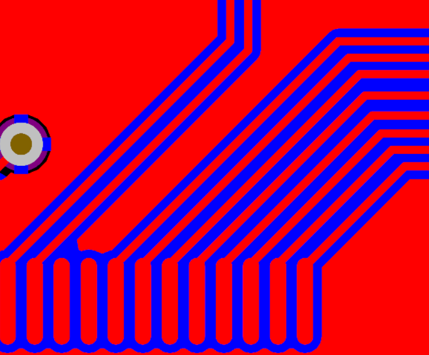
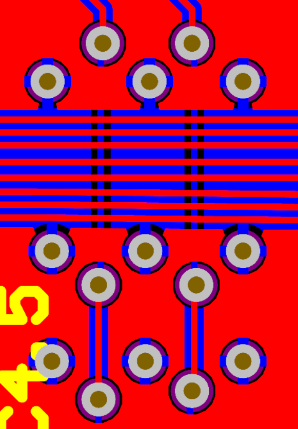

# UBC Solar x PCbWay Driver Dashboard Showcase!

The Driver Dashboard (DRD) is a PCB designed to act as the central hub of the interface between the driver and the solar racing car featuring LEDs, switches, and an LCD to display critical information of the car. This repository will go into details about the hardware design of this PCB from schematic to layout design. 

Additionally, this project was sponsored by [**PCBWay**](https://www.pcbway.com/), who provided PCB manufacturing support and quick design review for the DRD! During the review process, they clarified aspects of the layout and identified a design fault, which was confirmed and resolved prior to the board being produced.

*Overall view of the Driver Dashboard (DRD) PCB.*

### Front Side
 

*Front side of the DRD showing user interface components and signal routing.*

### Back Side

*Back side of the DRD highlighting power routing and ground plane coverage.*

## Project Overview

The DRD is controlled by an STM32F103RCT6 microcontroller responsible for managing 
* Low-voltage vehicle functions 
* Exterior lighting control of TruFlex Turn signals, fault, and hazard lights.
* Drive-state selection for park, reverse, and forward
* LCD Display for car vitals, speed, drive state, etc.

 The board interfaces with the vehicle CAN bus to receive real-time telemetry such as fault conditions, M2096 Mitsuba motor controller status signals, and the supplemental battery voltage, which are processed and displayed to the driver.

## Motor Control
Here is an example of the result of this board:

## Layout 

The DRD layout was driven by mechanical constraints and dashboard integration requirements, defining the placement of connectors, switches, and the display. Functional partitioning was used to group subsystems such as the Microcontroller Unit (MCU), CAN transceiver, and N-channel MOSFET LED drivers, to maximize the space usage of the board.

## Routing

With the various subsystems involving 30+ GPIOs, analog signals, and most importantly communication lines, various routing practices were used during this design process.

### Ground Plane Continuity

*0 Ω resistors used as signal jumpers to preserve ground plane continuity and short return paths.*

In order to prevent the GND plane being cut off by traces, 0 ohm resistors were used for some digital signals to bypass routes to create a continuous place for short return paths.

### Trace Geometry

*Curved trace routing used to avoid abrupt geometry changes and maintain consistent signal behavior.*

Curved traces were used in place of 90-degree corners to avoid sudden changes in the geometry. An abrupt change will create a small area where the impedance will be decreased due to a larger area being present in the bend that causes slight impedance discontinuites in addition to minor reflections in fast signals.

### Ground Stitching Vias

*Ground stitching vias used to reduce return path impedance and improve plane connectivity.*

Stiching vias were put in place as some traces switched between the planes due to hte large number of signals coming from the MCU. Stiching vias act as a stable reference for signals when they cross planes by having a continuous GND trace going from the top to bottom layer of the board that prevents magnetic coupling from the outside going to the inside.

### CAN Differential Pair Routing

*CAN differential pair routing with consistent spacing and coupling to maintain noise immunity.*

CAN communication uses differential pair signaling, where a signal and its inverse are transmitted on a matched pair of traces such that external interference couples similarly into both lines. The receiver measures the voltage difference between the two signals, improving noise immunity by rejecting common-mode interference in the electrically noisy vehicle environment.

## Future Improvements

While the DRD integrates a large number of signals, future revisions would further refine component placement and routing to minimize signals crossing plane splits. Board area could also be optimized by tightening component spacing and reorganizing functional blocks, allowing the overall board length to be reduced.
