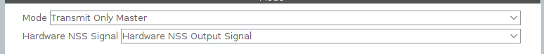
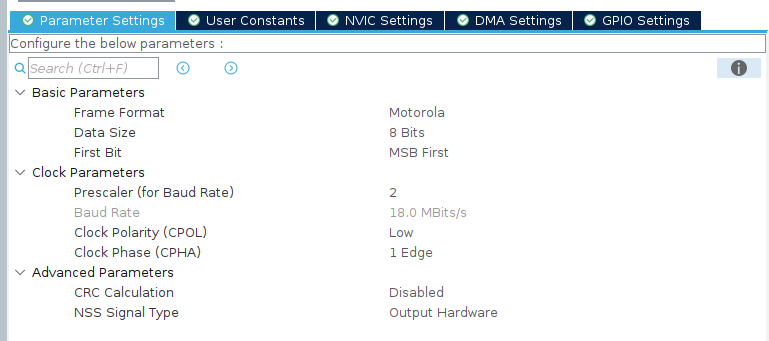

# USAGE
This README explains how to use the LCD library. This is intended for use on the DRD.

## Useful Links
* [DRD Altium Link](https://ubc-solar.365.altium.com/designs/A1D09E3F-0EB6-42A4-A897-C945D50A3C55?variant=[No+Variations]&activeDocumentId=E_PAS_DRD.SchDoc(1)&activeView=SCH&location=[1,95.68,26.62,35.19]#design)
* [LCD Basic Arduino Functionality GitHub Link](https://github.com/NewhavenDisplay/NHD-C12864A1Z_Example/blob/main/NHD-C12864A1Z/NHD-C12864A1Z.ino#L197)
* [LCD Printing Library GitHub Link](https://github.com/edeca/Electronics)
* [LCD Screen](https://newhavendisplay.com/content/specs/NHD-C12864A1Z-FSW-FBW-HTT.pdf)
* [LCD ST7565P Controller Datasheet](https://support.newhavendisplay.com/hc/en-us/article_attachments/4414878945687)

## What this Library Comes With
* Adds the weight of extra logic to program the LCD screen
* Adds a **1024 byte buffer** to hold LCD pixels. 
* Adds 6 files `lcd_driver.h`, `lcd_driver.c`, `lcd_app.h`, `lcd_app.c`, `font_verdana.h`, and `font_verdana.c` to your project.

## Initialization
Call the `LcdAppInit()` function once with a **pointer** to your SPI handle. This will likely occur in your `main.c` code. To initialize the SPI peripheral correctly set these fields as follows:

Possible differences
* Since the DRD does not have a 32kHz crystal oscillator you will likely have a different baudrate. The default baudrate **should** work, however, when debugging consider this problem.

## How to use the Driver
`lcd_driver.c` initializes the SPI peripheral for communication to the lcd and contains functions to help display values:
1. `LcdDriverSetPixel()` draws a pixel at a specified location.
2. `LcdDriverClearBoundingBox()` clears a bounding box.
3. `LcdDriverDrawRectangle()` draws a rectangle.
4. `LcdDriverDrawText()`draws text based on the font libraries in `font_verdana.c`.
5. `LcdDriverDrawChar()` draws a character.

Optimization: ST7565_DIRTY_PAGES is an optimization constant that creates the variable lcd_dirty_pages. The screen will only update if lcd_dirty_pages != 0 which happens in `LcdDriverRefresh()`. Firmware is optimized to avoid errors in refreshing page.

## Font Libraries
All font libraries are included in `font_verdana.c`. If a character is needed search through the fonts [here](https://github.com/edeca/Electronics/tree/master/Include/fonts). If it is not included either hardcode it or ask ChatGPT to generate a Bitmap. Creating your bitmap is possible, but unideal and tedious. 

## How to Use Pages
Pages are switched over CAN under the id `0x580`. When switching pages, the firmware clears the screen with the `LcdAppChangeScreen` function and the freertos `LcdUpdateTask` handles what is displayed on each screen through various functions.

To add a page, adjust the `MAXPAGES` constant in `lcd_app.h`. Then create functions in `lcd_app.c` and add them in a new case in freertos under `LcdUpdateTask`. 

**USE `lcd_driver.c` ONLY FOR HELPER FUNCTIONS TO USE IN `lcd_app.c`. IT INITIALIZES THE DISPLAY AND STORES THE LCD BUFFER. DO NOT WRITE DISPLAY FUNCTIONS IN THE DRIVER**

## Pages
The LCD has 5 pages:
1. Drive Page (SOC, Mode, State, Speed, Fault and Warning indicators)
2. Fault Page (Battery and Motor faults sent over CAN)
3. Warnings Page (Elec warnings sent over CAN)
4. Temperature Page (Battery, Motor, MPPT Temperatures)
5. Debug Page (Pack Power bar)

## How to Set Values
There are 7 main pieces of datas we display on the LCD screen on various pages
1. Speed (mph or kph)
2. Drive State (Drive 'D', Reverse 'R', Park 'P')
3. Drive Mode (E for Eco, ↯ for power)
4. SoC (State of Charge in %) 
5. Pack Power as a horizontal bar
6. Faults (💀 Indicator on Drive Page, Specific faults on Fault Page)
7. Warnings (Ø Indicator on Drive Page, Specific warnings on Fault Page)
8. Temperature (°C)

### Displaying the Speed
Call the `LcdAppDisplaySpeedDrivePage(speed, units)` or `LcdAppDisplaySpeedDebugPage(speed, units)` function in their respective screens with the following parameters
* `speed`: The speed you want to display. This is a `uint32_t` type.
    * Speed will display normally **only** if `0 <= speed < 100`. Basically, 2 digits is the max displayed.
* `units`: The units you want to display. either `MPH` or `KPH`. These are defined in `lcd.h`.

### Displaying the Drive State
Call the `LcdAppDisplayDriveStateDrivePage(drive_state)` or `LcdAppDisplayDriveStateDrivePage(drive_state)` function in their respective screens with the following parameter
* `drive_state`: The drive state you want to display. This is one of the following defines:
    * `FORWARD_STATE` displays a `D`, `REVERSE_STATE` displays a `R`, or `PARK_STATE` displays a `P`. These are defined in `lcd.h`.

### Displaying the SoC
Call the `LcdAppDisplaySocDrivePage(soc)` or `LcdAppDisplaySocDrivePage(soc)` function with the following parameter
* `soc`: The SoC you want to display. This is a `uint32_t` type.
    * SoC will display normally **only** if `0 <= soc < 100`. Basically, 2 digits is the max displayed.
    * `100%` will display normally although the `%` will be cut off.

### Displaying the Pack Power
Call the `LcdAppDisplayPowerBar(pack_current, pack_voltage)` function with the following parameters
* `pack_current`: The current you want to display. This is a `float` type
* `pack_voltage`: The voltage you want to display. This is a `float` type

The intention is to take these values directly from the CAN message and input them into this function.
* Note: We use **`-3000W`** as the minimum power and **`+5400W`** as the maximum power. This is to ensure the bar is always displayed correctly. The calculated power will be normalized to this range.

### Displaying the Faults
Call the `LcdAppDisplayFaultIndicator(g_lcd_batt_faults, g_lcd_motor_faults)` function on the drive page initialized in FreeRTOS. 

* `g_lcd_batt_faults`: The battery faults included in a struct of booleans with 
    * Speed will display normally **only** if `0 <= speed < 100`. Basically, 2 digits is the max displayed.
* `g_lcd_motor_faults`: The units you want to display. either `MPH` or `KPH`. These are defined in `lcd.h`.
All faults must be included in the struct through CAN and when a fault is triggered the indicator will appear.

Call the `LcdAppDisplayFaults(g_lcd_batt_faults, g_lcd_motor_faults)` function on the fault page to display faults.

## Library Functionality
There are extra functions we can add to the library, however, they are removed to make the file simple to read. Please see this [link](https://github.com/edeca/Electronics) for the original library code which also has more fonts!